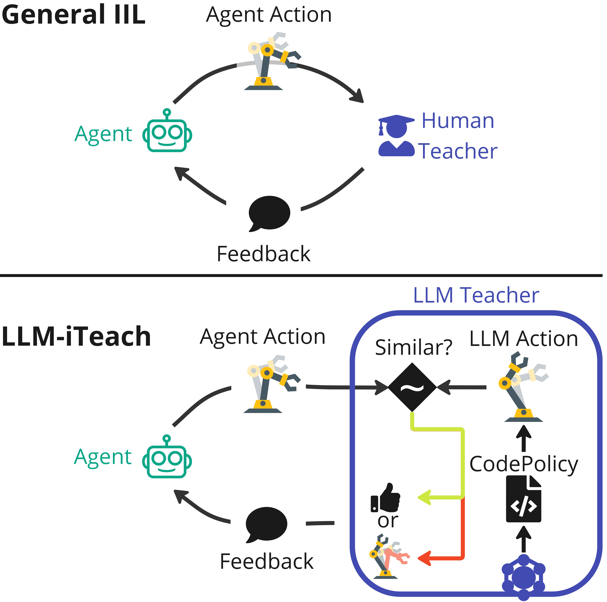

# LLM-iTeach for Robot Manipulation with RLBench

  

_Figure: Comparison of General IIL framework and our proposed LLM-iTeach. In IIL, a human teacher observes the agent’s actions and provides timely feedback. In contrast, LLM-iTeach first prompts the LLM to encapsulate its reasoning hierarchically into CodePolicy, and then provides feedback to the agent in an evaluative or corrective manner through the similarity-checking mechanism designed in LLM-iTeach._

## Description

This repository contains the code used for the experiments presented in my master's thesis, where we evaluate **LLM-iTeach** and **Behavior Cloning (BC)** on robot manipulation tasks from the [RLBench](https://github.com/stepjam/RLBench) benchmark. The experiments follow the CEILing framework to ensure comparability.

⚠️ **Note:** The code was used _as-is_ with additional computer specific configurations to generate the results in the paper. Compatibility on individual systems is **not guaranteed**, and adjustments may be required depending on your environment. Please feel free to reach out if you need assistance.

### Key Notes

- **LLM Configuration**: The code requires access to an LLM and must be configured appropriately in `LMP.py`.
- **Prompt Design**: Prompt fragments live in `prompts/` and are assembled hierarchically in `lmp.py`.
- **Generated Policies**: The `codepolicies/` directory contains LLM-generated control code used by the agent in task execution.
- **Camera Support**: The current implementation does **not fully support** the dual-camera setup in RLBench.

## 📄 Thesis Paper

🔗 [Link to the paper](https://arxiv.org/abs/2504.21769)
